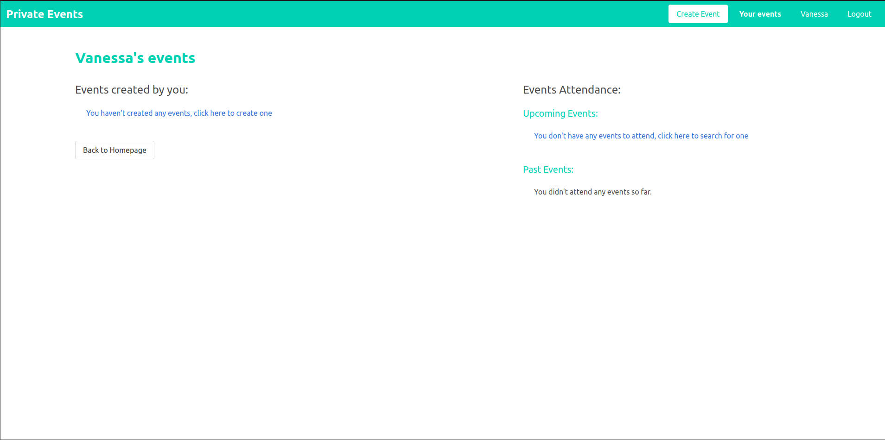

<p align="center">
  <a href="https://www.microverse.org/">
    
  </a>
  <a href="https://github.com/Emmyn5600/PrivateEvent/blob/development/LICENSE">
    
  </a>
  <a href="https://github.com/Emmyn5600/PrivateEvent">
    
  </a>
   <a href="https://github.com/Emmyn5600/PrivateEvent">
    
  </a>
  <a href="https://github.com/Emmyn5600/PrivateEvent">
    
  </a>
</p>
</p>


# Private Events (Eventbrite)
This is an exclusive app where users can create events and then manage user signups. Users can create events and send invitations and parties
> This is the 5th project of the Micoverse's Ruby on Rails module, the full description can be found at [the Odin Project’s](https://www.theodinproject.com/courses/ruby-on-rails/lessons/associations) website.





**What you can do with this project**
- You can create Users and Events;
- Once you sign in, you can:
  - create events, with giving it a title, description, date, and location;
  - attend or ignore events;

## Built With

- Ruby 2.7.2;
- Ruby on Rails 6.1.3;
- Ruby gems: devise, bulma, simple-forms, sqlite3, puma, sass-rails, webpacker, turbolinks, jbuilder, rubocop;
- Visual Studio, Git & GitHub;

## Live Server Link
[Live demo link](https://private-event-1.herokuapp.com/)


## Prerequisites
To run this project, you need a computer with Ruby and Ruby on Rails installed.

> If you are uncertain about how to install Ruby, check out this [tutorial](https://www.theodinproject.com/courses/ruby-programming/lessons/installing-ruby-ruby-programming) made by [The Odin Project](https://www.theodinproject.com/about).

> If you are uncertain about how to install Ruby on Rails, check out this [tutorial](https://www.theodinproject.com/paths/full-stack-ruby-on-rails/courses/ruby-on-rails/lessons/your-first-rails-application-ruby-on-rails) made by [The Odin Project](https://www.theodinproject.com/about).

## Getting Started

To get a local copy up and running, follow these simple steps:

1. In your terminal, type the following, to clone this repository:
```
$ git clone https://github.com/Emmyn5600/PrivateEvent.git
```
2. Type  `$ cd PrivateEvent` to move to the project folder;

3. Install all required gems by typing `$ bundle install` on the terminal;

4. Migrate the database with `$ rails db:migrate`;

5. Type `$ cd bin` to move to the bin folder, *you must be on this folder to execute the file*;

6. Execute `$ rails server` on the terminal and run `http://localhost:3000` on your browser *(Google Chrome, Mozilla Firefox, Microsoft Edge, Apple Safari, etc.)*;

7. Explore the app, sign up - or sign in if you are already a user - create and attend events;

8. After you are done, stop running the server by clicking `ctrl + C` on your terminal.

## Authors

🧑‍💻 **NSABIMANA Emmanuel**

- GitHub: [@emmyn5600](https://github.com/Emmyn5600)
- Twitter: [@NSABIMA62253884](https://twitter.com/NSABIMA62253884)
- LinkedIn: [@nsabimana-emmanuel-4276091b2](https://www.linkedin.com/in/nsabimana-emmanuel-4276091b2/)


👩🏼‍💻 **Vanessa Aoki**

- GitHub: [@VanessaAoki](https://github.com/VanessaAoki)
- Twitter: [@VanessaSAoki](https://twitter.com/VanessaSAoki)
- Linkedin: [Vanessa Aoki](https://www.linkedin.com/in/vanessasaoki/)

## 🤝 Contributing

Contributions, issues, and feature requests are welcome!

Feel free to check the [issues page](https://github.com/Emmyn5600/PrivateEvent/issues).

## Show your support

Give a ⭐️ if you like this project!

## Acknowledgments

- Microverse

## 📝 License

This project is [MIT](./LICENSE) licensed.
