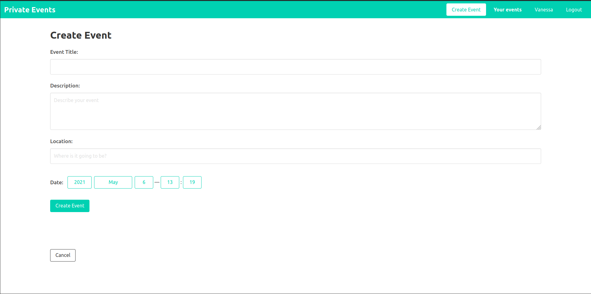
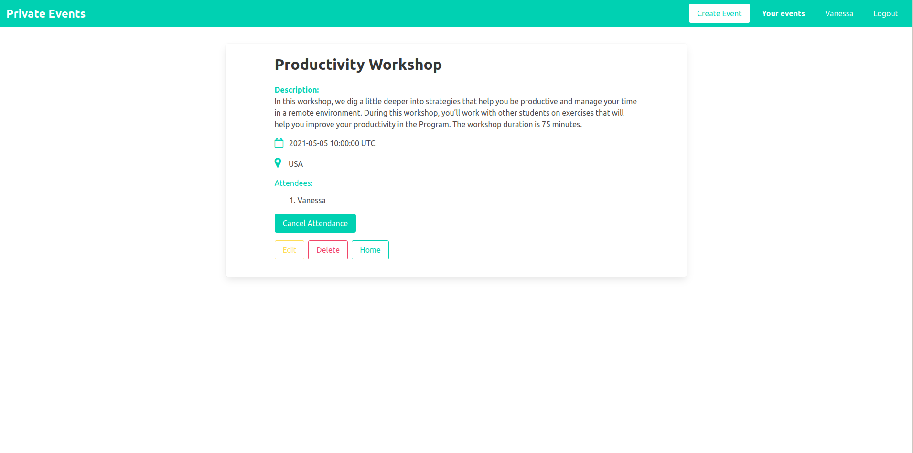

  
  
  

# Private Events (Eventbrite)
> This is an exclusive app where users can create events and then manage user signups.
> Users can create events and send invitations and parties [the Odin Project’s](https://www.theodinproject.com/courses/ruby-on-rails/lessons/associations).

**What you can do with this project**
- You can create Users and Events;
- Once you sign in, you can:
  - attend or Ignore meetings;
  - create events with date and location

## Built With

- Ruby 2.7.2;
- Ruby on Rails 6.1.3;
- Ruby gems: devise, bulma, simple-forms, sqlite3, puma, sass-rails, webpacker, turbolinks, jbuilder, rubocop;
- Visual Studio, Git & GitHub;

## Prerequisites
Make sure that your system has the proper prerequisites installed. These include:

- Ruby
- SQLite3
- Node.js
- Yarn

If you need step by step installation guidence, visit [this page](https://guides.rubyonrails.org/getting_started.html#creating-a-new-rails-project-installing-rails).

## Getting Started

To get a local copy up and running follow these simple example steps.

- On the project GitHub page, navigate to the main page of the repository [this page](https://github.com/Emmyn5600/PrivateEvent.git).
- Under the repository name, locate and click on a green button named `Code`.
- Copy the project URL as displayed.
- If you're running Windows Operating System, open your command prompt. On Linux, Open your terminal.
- Change the current working directory to the location where you want the cloned directory to be made. Leave as it is if the current location is where you want the project to be.
- Type `git clone`, and then paste the URL you copied in Step 3. 
  `$ git clone https://github.com/Emmyn5600/PrivateEvent.git` <em>Press Enter key</em> 
- Press Enter. Your local copy will be created.

Please Note that you must have Git installed on your PC, this can be done [here](https://gist.github.com/derhuerst/1b15ff4652a867391f03).

## How to use the app?

1. Follow Getting Started section to download the app
2. Open/navigate to the project directory in your terminal
3. Run `bundle install`
4. Run `rails db:create`
5. Migrate, run `rails db:migrate`

## How to run tests?

1. Follow Getting Started section to download the app
2. Open/navigate to the project directory in your terminal
3. Run `rails s` or `rails server`.
4. You will be asked to open `http://localhost:3000/` in your terminal. Open it and you are ready to use with User Interface.

## Authors

🧑‍💻 **NSABIMANA Emmanuel**

- GitHub: [@emmyn5600](https://github.com/Emmyn5600)
- Twitter: [@NSABIMA62253884](https://twitter.com/NSABIMA62253884)
- LinkedIn: [@nsabimana-emmanuel-4276091b2](https://www.linkedin.com/in/nsabimana-emmanuel-4276091b2/)

👩🏼‍💻 **Vanessa Aoki**

- GitHub: [@VanessaAoki](https://github.com/VanessaAoki)
- Twitter: [@VanessaSAoki](https://twitter.com/VanessaSAoki)
- Linkedin: [Vanessa Aoki](https://www.linkedin.com/in/vanessasaoki/)

## 🤝 Contributing

Contributions, issues, and feature requests are welcome!

Feel free to check the [issues page](https://github.com/Emmyn5600/PrivateEvent/issues).

## Show your support

Give a ⭐️ if you like this project!

## Acknowledgments

- Microverse

## 📝 License

This project is [MIT](https://en.wikipedia.org/wiki/MIT_License) licensed.